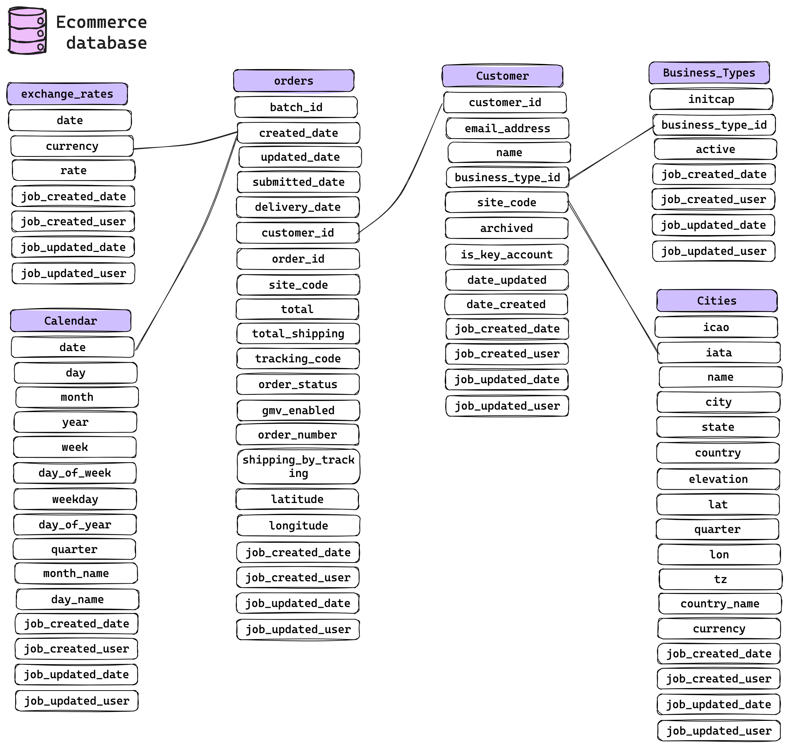
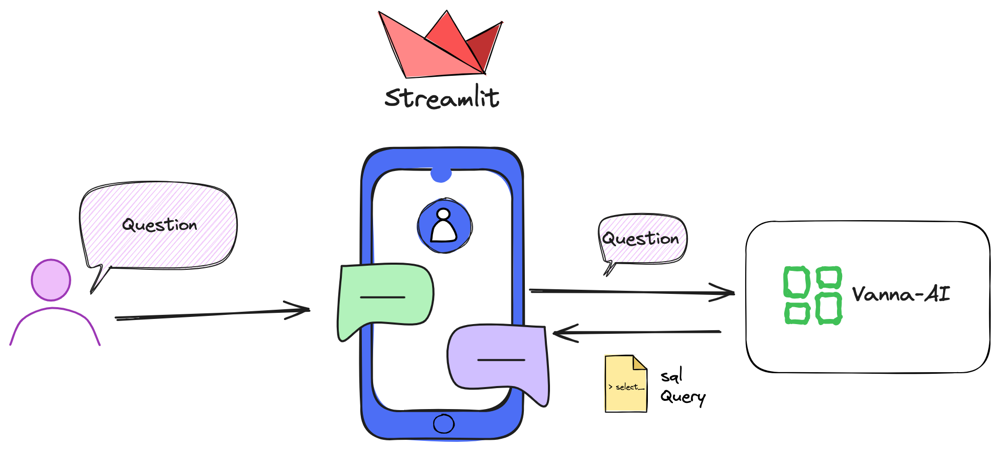
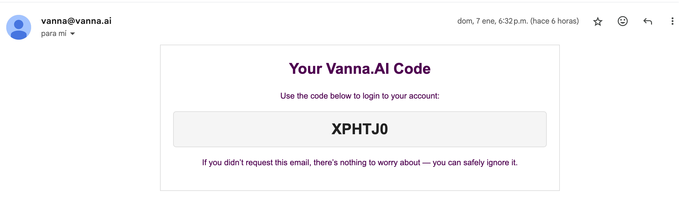
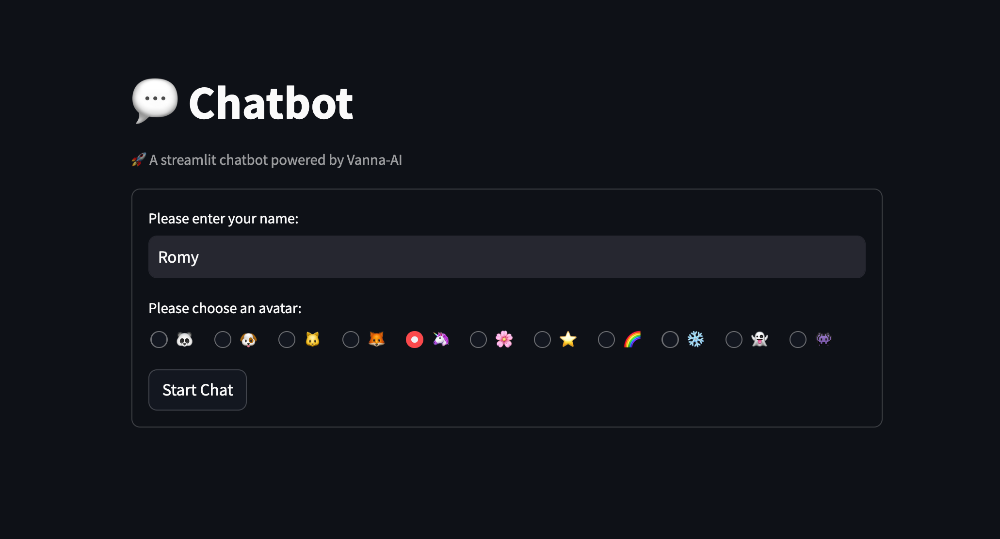
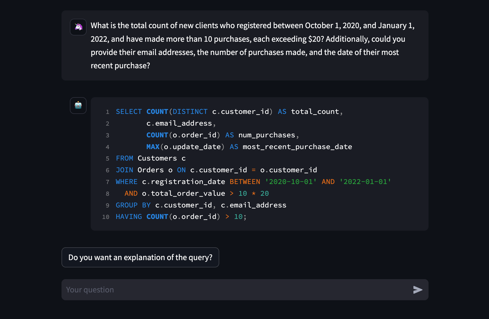
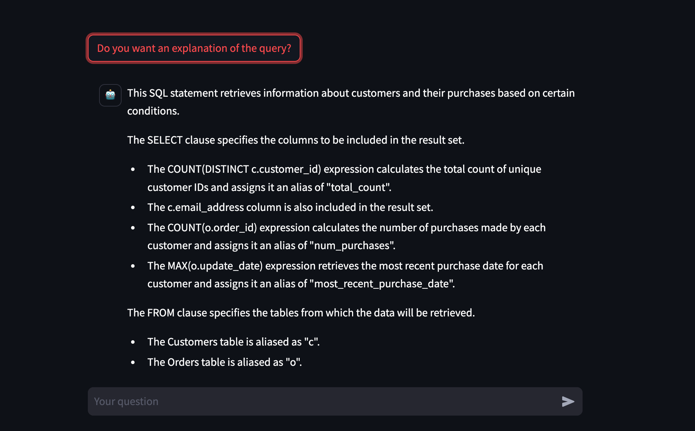

# SQL Assistant: Text-to-SQL Application in Streamlit 🤖

# ✨ What is Generative AI?
**`Generative AI`**  refers to a category of artificial intelligence systems that have the capability to generate new and original content, such as images, text, or other forms of data.

---

# 🧪 What is LLMs Models?
**Large Language Models (LLMs)** are a complex deep learning models trained on extensive datasets to comprehend and generate natural language text. These models utilize a transformer architecture, incorporating an encoder to extract nuanced meanings from input text sequences and a decoder to understand intricate relationships between words and phrases. The training process involves millions of data inputs, foundational for creating millions of hyperparameters that fine-tune the model's behavior. The significant computational demands during training are efficiently handled by Graphics Processing Units (GPUs), enabling accelerated processing and enhancing the model's proficiency in generating contextually rich and meaningful text.

---

# 🤖 Text-to-SQL & Vanna.ai

**Text-to-SQL** is a tool that utilizes models to translate natural language queries into SQL queries, aiming to make it easy for users to generate SQL queries and interact with databases seamlessly. 

The implementation of Text-to-SQL can be achieved through the use of [Vanna.AI](https://vanna.ai/), an open-source Python library that allows the training of an RAG model with queries, DDL, and documentation from a database. Subsequently, the tool can answer questions in natural language, provide explanations for SQL queries, connect to the database, and return a DataFrame with the results or generate Plotly graphs.

<br>


---

## Vanna.AI: Output Possibilities

The following are the possible outputs that can be generated with Vanna methods, facilitating diverse ways of interacting with the database using natural language.

* **📄 SQL**: Vanna.AI can generate SQL queries from natural language questions. These SQL queries can be used to interact with a database.

* **📁 DataFrame**: After generating an SQL query, Vanna.AI can execute it in the database and return the results as a pandas DataFrame.

* **📊 Charts**: Vanna.AI can generate plots using Plotly from the results of the SQL query.

* **❓ Follow-up questions**: Vanna.AI can generate follow-up questions based on the generated SQL query. These follow-up questions can help users refine their queries or explore the data in more detail.

* **🔍 Explanations queries**: Vanna.AI can provide explanations for the generated SQL queries. These explanations can help users understand how their natural language question is interpreted into an SQL query.

---

## Vanna.AI: Features

| Feature | Description |
|---------|-------------|
| **🚀 Model Training** | Train the RAG model on data sources, including Data Definition Language (DDL) statements, documentation, and SQL queries during the training process. |
| **🤖 User Query Handling** | Users can pose questions in natural language, and Vanna.AI responds by generating SQL queries. |
| **📚 Documentation** | Extensive documentation, a dedicated website, and a support community on Discord are available to offer comprehensive assistance. | 
| **🔌 Database Connections** | Vanna allows connecting to multiple databases, enabling users not only to retrieve SQL queries but also to execute them by establishing connections to their respective databases. |
| **🤔 AI-Generated Recommendation Questions** | This framework includes a feature of generating AI-driven questions, offering suggestions for additional queries that the user could explore. |

---

# 🧪 Train the model 
To train your own model follow the following steps:
1. Log in to your account https://vanna.ai/ and create a new model.
2. Next we will define how to train the model. In our next example we will use ddl (data definition language), documentation and queries.
3. Ask a question.



---

# 💬 Streamlit Chatbot

In the `src\` folder 📁, you'll find an application crafted with Vanna.AI and Streamlit, utilizing the implementation of chat elements. Within this application, we've designed a chatbot where you input your username, select your avatar, and then initiate the chat.



In this chatbot application, you can pose questions related to the e-commerce database. The assistant will respond with the corresponding SQL query and provide a button that allows you to generate a detailed explanation of this query using the "generate_explanation" method.

---

## 💬 Streamlit Application Launch

### 1️⃣. Secrets File Setup 
Create a file named secrets.toml in the .streamlit folder with the following content. Replace the values for key with your registered email and model_name with the name of your model created on https://vanna.ai/.

`📄 scr\.streamlit\secrets.toml`
```toml
[vanna]
key = "your_email@mail.com"
model_name = "your_model_name"
```

### 2️⃣. Application Launch
To initiate the application, follow these steps:
```bash 
cd src
streamlit run main.py
```

### 3️⃣. Email Verification
Upon execution, the following message will appear in the terminal. It's necessary to enter the code received in the registered email.

```bash
  You can now view your Streamlit app in your browser.

  Local URL: http://localhost:8503
  Network URL: http://111.111.1.11:8503
  Check your email for the code and enter it here: 
```

Email example



---

# 🤖 Streamlit ChatBOT

[](https://youtu.be/V08FCQMr8NE)
<br>
[](https://youtu.be/V08FCQMr8NE)
<br>
[](https://youtu.be/V08FCQMr8NE)


---


# 📚 References
If you want to learn...
* [vanna-ai](https://github.com/vanna-ai/vanna)
* [streamlit](https://www.streamlit.io/)

---

[](https://www.buymeacoffee.com/r0mymendez)
